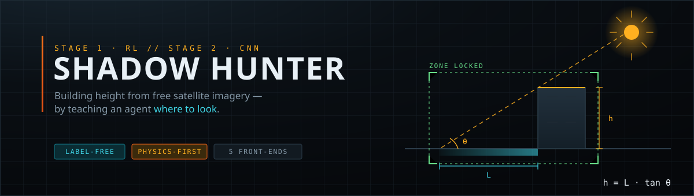

<div align="center">



<br><br>

**A deep-RL agent hunts for the one clean building shadow in a satellite tile.**<br>
**A physics-anchored CNN turns it into metres.**

<br>

[](LICENSE)
[](pyproject.toml)
[](https://pytorch.org)
[](https://stable-baselines3.readthedocs.io)
[](https://fastapi.tiangolo.com)
[](https://github.com/Jarvis-Mi/shadowhunter/actions)
[](#the-three-proxy-rewards)
[](#data)

<sub>
  <a href="#quick-start"><b>Quick start</b></a> &nbsp;·&nbsp;
  <a href="#how-it-works"><b>How it works</b></a> &nbsp;·&nbsp;
  <a href="#architecture"><b>Architecture</b></a> &nbsp;·&nbsp;
  <a href="#the-five-interfaces"><b>Interfaces</b></a> &nbsp;·&nbsp;
  <a href="#http-api"><b>API</b></a> &nbsp;·&nbsp;
  <a href="#roadmap"><b>Roadmap</b></a> &nbsp;·&nbsp;
  <a href="README.fa.md"><b>فارسی</b></a>
</sub>

</div>

---

## Table of contents

- [The problem this solves](#the-problem-this-solves)
- [How it works](#how-it-works)
  - [The three proxy rewards](#the-three-proxy-rewards)
  - [Two design decisions worth defending](#two-design-decisions-worth-defending)
- [Quick start](#quick-start)
- [Architecture](#architecture)
- [Project layout — MVT](#project-layout--mvt)
- [The five interfaces](#the-five-interfaces)
- [Training](#training)
- [HTTP API](#http-api)
- [Command reference](#command-reference)
- [Data](#data)
- [Testing](#testing)
- [Roadmap](#roadmap)
- [Contributing](#contributing)
- [Citation](#citation)
- [Licence](#licence)

---

## The problem this solves

Shadow-based height estimation is old and simple:

```
h = L · tan(θ_sun)
```

It also falls apart in exactly the places you care about. In a dense city, one building's
shadow lands on its neighbour's roof. Feed that crop to an ordinary CNN and it predicts
something between the two heights — confidently, and wrongly. The published failure mode
has a name: **occlusion**.

The usual answers are to buy higher-resolution commercial imagery, or to throw a larger
network at the problem. Shadow Hunter takes a third route:

> **Fix the input, not the model.**

An RL agent moves a window over the tile and learns to stop on a zone where the shadow is
clean. The regressor only ever sees good crops.

The reward it learns from uses **no ground-truth height at all** — only the pixels and the
sun angle that ships in the image metadata. That is what lets the method generalise to
cities where no height labels exist, which is most of them.

---

## How it works

| | Stage | What happens | Learns from |
|---|---|---|---|
| **1** | **Zone selection** | A Gymnasium agent (PPO/DQN) pans, grows and shrinks a window until it isolates a single, unoccluded, unclipped shadow — then commits. | Label-free proxy rewards |
| **2** | **Height regression** | A PyTorch CNN reads the committed crop plus a physics side-channel and predicts a *residual* around `L·tan θ`, with a calibrated σ. | Height labels (SpaceNet / synthetic) |
| **3** | **Fusion** | Analytic and learned estimates are blended by inverse variance, weighted by how clean the zone actually was. | — |

Output: **`h ± σ`**, storey count, and a confidence score.

### The three proxy rewards

Every one is computable from the crop alone. Each has a different blind spot, which is why
all three vote — see [`shadowhunter/models/rl/rewards.py`](shadowhunter/models/rl/rewards.py).

| | Reward | Formula | Catches | Blind spot |
|---|---|---|---|---|
| **R1** | Contrast · isolation | `contrast × isolation × coverage_band` | One dark region separating cleanly from sunlit ground | A lake or an asphalt lot scores well too |
| **R2** | Structural purity | `edge_coherence × (1 − entropy)^½` | Edge energy concentrated on the shadow boundary — the signature of one building | Fooled by any single high-contrast object |
| **R3** | Azimuth coherence | `axis_alignment × elongation × (1 − truncation)` | A blob elongated *along the direction the sun casts* | Needs the sun angle; degrades at high solar elevation |

Two penalties are subtracted:

- **Occlusion** — every shadow pixel not belonging to the dominant blob is, by construction,
  a neighbour's shadow leaking in.
- **Truncation** — a shadow clipped by the crop border has an unmeasurable length.

The composite is fed through **potential-based shaping** (Ng et al., 1999), so the agent
receives the *improvement* in score each step. That preserves the optimal policy while
making credit assignment dense enough for PPO to learn on a laptop in minutes rather than
days.

### Two design decisions worth defending

**The CNN predicts a residual, not a height.** The analytic estimate `L·tan θ` enters the
head directly, so the network never has to relearn trigonometry and stays honest on sun
angles it has not seen. It also means a partly-trained model degrades to physics rather
than to noise.

**There is a training-free baseline in the box.** `greedy_hunt` hill-climbs the same proxy
score with the same action set. It makes the whole application work on a cold install
before a single timestep of training — and it is the ablation a reviewer will ask for:
*does the learned policy actually beat greedy search?*

---

## Quick start

**Requirements** — Python 3.10 – 3.13. A GPU is optional; everything below runs on CPU.

```bash
git clone https://github.com/Jarvis-Mi/shadowhunter.git
cd shadowhunter
```

```bash
python -m venv .venv && .venv\Scripts\activate
```

<sub>macOS / Linux: <code>python3 -m venv .venv && source .venv/bin/activate</code></sub>

```bash
pip install -r requirements.txt
```

Check what the environment actually has:

```bash
python run.py doctor
```

That prints which parts of the stack are present and whether CUDA is available. Then launch
the flagship interface:

```bash
python run.py deck
```

The deck boots its own backend, synthesises a city, runs a hunt with the greedy baseline and
shows you a height in about a second.

> [!NOTE]
> **No dataset download is required to see the whole pipeline work.** The synthetic city
> generator produces physically consistent scenes, including the occlusion the agent exists
> to defeat.

---

## Architecture

```
                      ┌─────────────────────────────────────────────┐
   GeoTIFF / PNG ────►│  Scene   rasterio · OpenCV · synthetic city  │
   (or synthesised)   └──────────────────┬──────────────────────────┘
                                         │  image + sun azimuth/elevation + GSD
                    ┌────────────────────▼────────────────────────┐
                    │  STAGE 1 — RL zone selection                │
                    │  Gymnasium env · PPO/DQN (Stable-Baselines3)│
                    │  state  : 84×84×4 view + 9 scalars          │
                    │  action : 8 moves · grow · shrink · commit  │
                    │  reward : R1+R2+R3 − occlusion − truncation │
                    └────────────────────┬────────────────────────┘
                                         │  a clean single-building zone
                    ┌────────────────────▼────────────────────────┐
                    │  STAGE 2 — height regression                │
                    │  PyTorch CNN over RGB + shadow mask         │
                    │  physics side-channel: θ_sun, GSD, L        │
                    │  predicts a residual around h = L·tan θ     │
                    │  + a calibrated σ (heteroscedastic head)    │
                    └────────────────────┬────────────────────────┘
                                         │
                    ┌────────────────────▼────────────────────────┐
                    │  FUSION — inverse-variance blend of the     │
                    │  analytic and learned estimates, weighted   │
                    │  by how clean the zone actually was         │
                    └────────────────────┬────────────────────────┘
                                         │
                             h ± σ  ·  storeys  ·  confidence
```

---

## Project layout — MVT

```
shadowhunter/
├── models/                     M — domain + machine learning (no UI, no HTTP)
│   ├── vision/
│   │   ├── shadow_ops.py       OpenCV shadow masks + the label-free metrics
│   │   ├── preprocess.py       rasterio/OpenCV I/O + the synthetic city
│   │   └── height_cnn.py       PyTorch regressor with the physics channel
│   ├── rl/
│   │   ├── env.py              ShadowHunterEnv (Gymnasium)
│   │   ├── rewards.py          R1 / R2 / R3 + composite + shaping
│   │   ├── agent.py            SB3 wrapper + greedy baseline
│   │   └── callbacks.py        telemetry + cooperative abort
│   ├── pipeline.py             orchestration: hunt → regress → fuse
│   ├── schemas.py              pydantic contracts crossing the wire
│   └── store.py                SQLite job + analysis history
│
├── views/                      V — controllers and front-ends
│   ├── api/                    FastAPI: analysis, scenes, training, telemetry
│   ├── desktop/pyside/         PySide6 instrument deck        [flagship]
│   ├── desktop/ctk/            CustomTkinter field console
│   ├── desktop/flet_app/       Flet mission control
│   ├── desktop/dpg/            DearPyGui telemetry scope
│   └── web/                    NiceGUI browser observatory
│
├── templates/                  T — the design system, rendered per toolkit
│   ├── tokens.json             one palette, one type scale, one motion curve
│   ├── theme.py                emits QSS · CSS vars · Flet dict · CTk JSON · DPG tuples
│   ├── qss/app.qss             Qt stylesheet with {{token.path}} placeholders
│   ├── web/styles.css          the browser sheet
│   └── components/svg.py       toolkit-independent dial + sparkline
│
└── services/                   the transport that connects views to models
    ├── client.py               DeckClient — the ONE client all five UIs use
    └── supervisor.py           embed the API in-process for single-binary launch
```

The rule that makes this hold together:

> **No view imports `models` directly, and no view hard-codes a colour.**

Views talk HTTP through `DeckClient` and read every colour, font and radius from
`templates/theme.py`. Change `tokens.json` once and all five interfaces move together; add
an endpoint once and all five gain the feature.

---

## The five interfaces

They are not five copies of the same screen. Each exists because a different toolkit is
genuinely the right tool for a different job.

| Command | Toolkit | Role |
|---|---|---|
| `python run.py deck` | **PySide6** | **The flagship.** Full operator deck — custom-painted scene canvas with the reticle and search trail, solar compass, live metric gauges, three stations (Hunt / Train / Archive). |
| `python run.py console` | **CustomTkinter** | **The light client.** Sub-second start, no Qt or Chromium, fits a 1366×768 field laptop. Take one measurement, read the numbers. |
| `python run.py control` | **Flet** | **The portable console.** Native Windows window today, browser on a tablet tomorrow, from the same file. Card-first and touch-sized. |
| `python run.py web` | **NiceGUI** | **The shared surface.** Runs in any browser on the network — for the supervisor, the reviewer, the conference demo. Full CSS, so it carries the most visual detail. |
| `python run.py scope` | **DearPyGui** | **The oscilloscope.** Immediate-mode plots at display rate for almost no CPU — the window you leave open on the second monitor for a six-hour training run. |

All five hit the same FastAPI backend. Start it once and point every client at it:

```bash
python run.py api
```

```bash
python run.py deck --url http://host:8077
```

…or let any client embed its own backend, which is the default.

---

## Training

```bash
python run.py train-rl --steps 20000 --algo PPO
```

```bash
python run.py train-cnn --scenes 24 --epochs 20
```

Or press the buttons in any UI. Training runs in a background thread on the server, streams
progress over the WebSocket event bus, and can be aborted cooperatively from any client.
Finished checkpoints land in `data/checkpoints/` and are auto-loaded on the next start.

---

## HTTP API

Interactive OpenAPI docs: **`http://127.0.0.1:8077/docs`**

| Method | Route | Purpose |
|---|---|---|
| `GET` | `/api/health` | device, torch/SB3 versions, which checkpoints are live |
| `POST` | `/api/analyze` | hunt one zone → height, σ, storeys, metrics, annotated PNG |
| `POST` | `/api/sweep` | hunt every building in a tile → MAE / RMSE against ground truth |
| `POST` | `/api/train/rl` · `/api/train/cnn` | start a background run |
| `GET` | `/api/train/jobs/{id}` · `POST .../abort` | monitor and stop |
| `GET` | `/api/train/artifacts` · `POST .../{name}/load` | list and activate checkpoints |
| `GET` | `/api/scenes` · `POST /api/scenes/upload` | manage tiles, including GeoTIFF upload |
| `WS` | `/ws/telemetry` | live training events |

---

## Command reference

```bash
python run.py doctor                    # environment + CUDA report
python run.py deck                      # PySide6 flagship deck
python run.py console                   # CustomTkinter light client
python run.py control                   # Flet portable console
python run.py web                       # NiceGUI browser observatory
python run.py scope                     # DearPyGui telemetry scope
python run.py api                       # backend only — OpenAPI docs at /docs
python run.py synth --count 8           # render and save synthetic tiles
python run.py train-rl --steps 20000    # train the zone-selection agent
python run.py train-cnn --epochs 20     # train the height regressor
python scripts/download_data.py --list  # where the free datasets live
python -m pytest                        # tests: no downloads, no GPU
```

---

## Data

Everything is free and open. Nothing here needs a commercial image.

| Dataset | Resolution | Licence | Role |
|---|---|---|---|
| **[SpaceNet](https://spacenet.ai)** (AWS) | 0.3 – 0.5 m | CC BY-SA | High-resolution imagery with footprints; the Urban 3D and SN7 subsets carry height labels. The training set for the CNN. |
| **[Sentinel-2 L2A](https://dataspace.copernicus.eu)** (ESA Copernicus) | 10 m | Free, open | Global, 5-day revisit, free forever. The archive the temporal extension searches. |
| **[Inria Aerial Image Labeling](https://project.inria.fr/aerialimagelabeling/)** | 0.3 m | Research | Aerial tiles with building masks; ideal for validating shadow segmentation against real imagery. |

```bash
python scripts/download_data.py --list
```

**And if you download none of them**, `synthesize_scene()` renders a physically consistent
overhead city:

- shadows obey `h = L·tan θ`;
- buildings are painted back-to-front along the shadow direction, so a taller neighbour
  genuinely occludes a shorter roof;
- shadows are rendered *cooler* as well as darker — which is exactly what the HSV ratio mask
  keys on.

The occlusion the agent exists to defeat is present in the simulator by construction.

---

## Testing

```bash
python -m pytest
```

```bash
ruff check .
```

The suite requires no dataset download and no GPU.

---

## Roadmap

The reconstruction proposed three ideas. **Idea 1 (Shadow Hunter) is what is implemented
here**, deliberately: it is the easiest to defend visually in a paper, and the RL environment
is the simplest of the three. The other two are extension points, not rewrites.

- [x] **Idea 1 — Shadow Hunter.** Spatial zone selection + physics-anchored regression.
- [ ] **Idea 2 — Smart Lens (dynamic zoom).** Already half-built: the action space includes
  `GROW`/`SHRINK` and `EnvConfig.crop_min/crop_max` bound the scale. Promoting scale to a
  first-class objective means adding a compute-cost term to the reward, so the agent pays for
  the pixels it asks for.
- [ ] **Idea 3 — Temporal selection.** The step from 2-D to 3-D. `Scene` already carries its
  own `SunGeometry`, and `quality_of_geometry()` scores how favourable an acquisition is. A
  temporal env wraps a *stack* of dated scenes and lets the agent move through time instead of
  space, choosing the month with the longest shadow and the least cloud.

Nearer-term work on what exists:

- [ ] Validate the proxy rewards against SpaceNet heights — does proxy score correlate with real error?
- [ ] Run the learned-vs-greedy ablation properly.
- [ ] Calibrate the reported σ against observed error.

---

## Contributing

Contributions are welcome. See **[CONTRIBUTING.md](CONTRIBUTING.md)** for the development
setup, coding standards and PR checklist, and **[CODE_OF_CONDUCT.md](CODE_OF_CONDUCT.md)**
for community expectations.

The two rules that matter most in this codebase:

1. **Keep the layers apart.** Views never import `models`; they go through `DeckClient`.
2. **Never hard-code a colour.** Every visual value comes from `templates/tokens.json`.

---

## Citation

If you use Shadow Hunter in academic work, please cite it:

```bibtex
@software{shadowhunter,
  title   = {Shadow Hunter: Label-Free Zone Selection for Shadow-Based
             Building Height Estimation},
  author  = {Shadow Hunter contributors},
  year    = {2026},
  url     = {https://github.com/Jarvis-Mi/shadowhunter},
  license = {MIT}
}
```

A machine-readable [`CITATION.cff`](CITATION.cff) is included.

---

## Licence

[MIT](LICENSE). Every dependency is open source; every dataset above is free to use.

<div align="center">
<br>
<sub>Built on an instrument-deck design system — <a href="shadowhunter/templates/tokens.json"><code>Orbital Dusk</code></a></sub>
</div>
